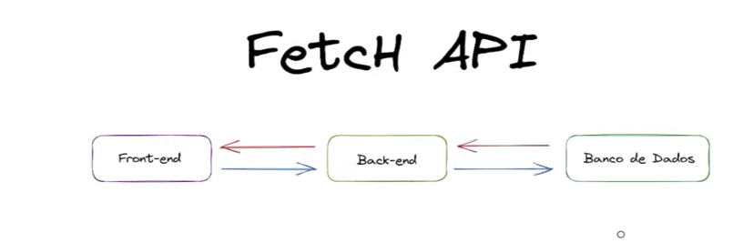

# front-begginers
Repositório do canal front beggginers no youtube com o intuito em estudar por 100 dias 

# Introdução 
Como instalar o vite: 
- `npm create vite@latest`
- `npm install`
- `npm run dev`

# Dominando o método map do Javascript 
`array = [1, 2, 3, 4, 5]; `
- índice = [ 0, 1, 2, 3, 4]
- Funções que estão dentro do array: **métodos** => Array.methods
- https://developer.mozilla.org/pt-BR/docs/Web/JavaScript/Reference/Global_Objects/Array 

# Como integrar uma API com fetch API fetch
- Aprender requisição HTTP utilizando fetch, criar uma API. 



## Em entrevistas de emprego eles vão pedir:
- Consumir uma API 
- Fazer requisições de buscar dados 
- Inserir dados 


- **Fech API**: mais simples
- **HTTP**: o front-end pede para o back-end que envia para o banco de dados que entrega 
- Essa requisição é uma requisição assíncrona, ou seja, demora um tempo, não acontece no mesmo momento.. Ela tem um tempo de espera, ela entra uma fila. Promessa de entrega, **promise**. 

## JSON: Forma de escrita dos dados
Precisam se comunicar devem ser iguais 
- É um padrão de comunicação de dados 

## Requisições: 
 - Post 
 - Update
 - Get 
 - Delete 

 ## Fetch 
 ```js
 fetch("http://example.com.movies.json")
 .then((response) => response.json())
 .then((data) => console.log(data)); 
 ```